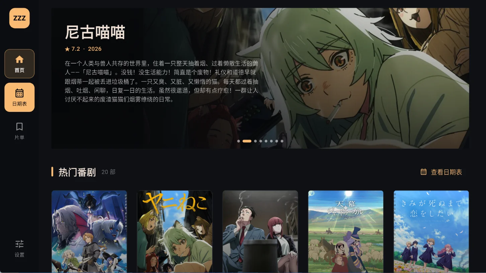
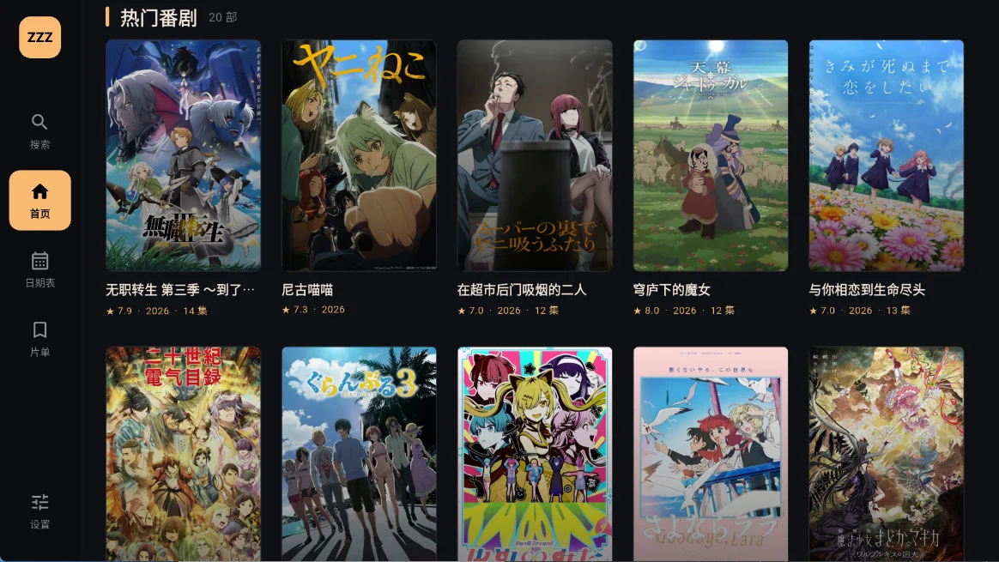
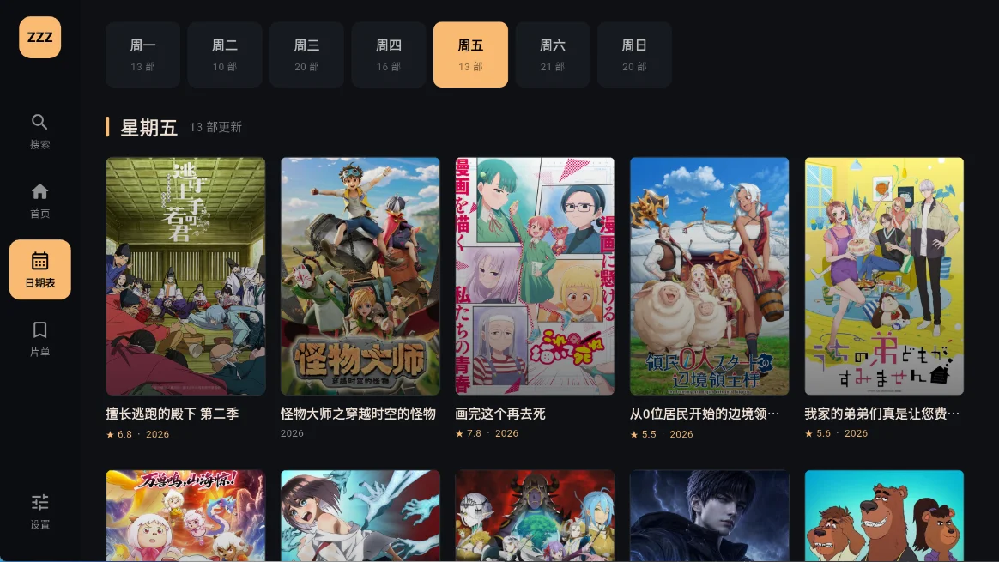
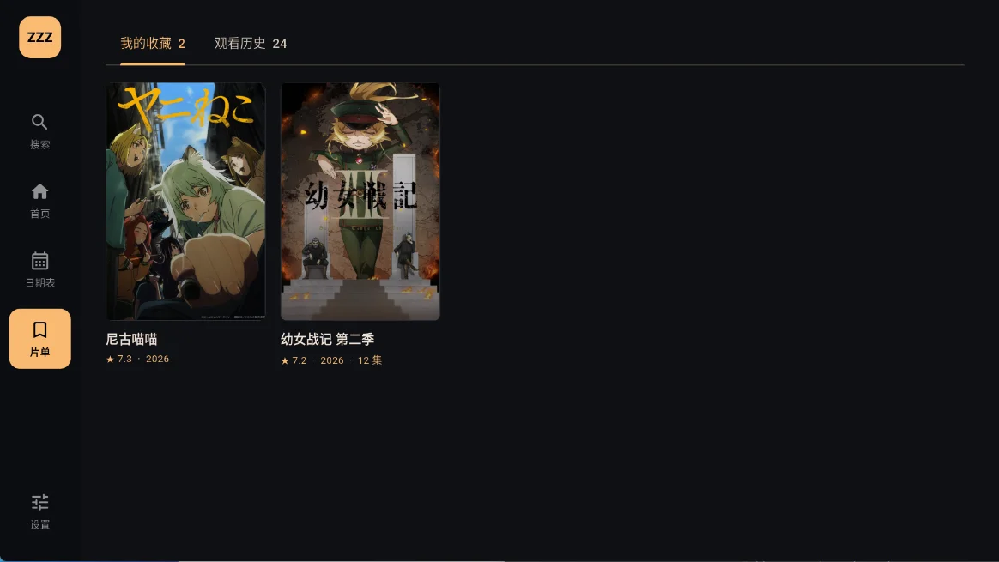
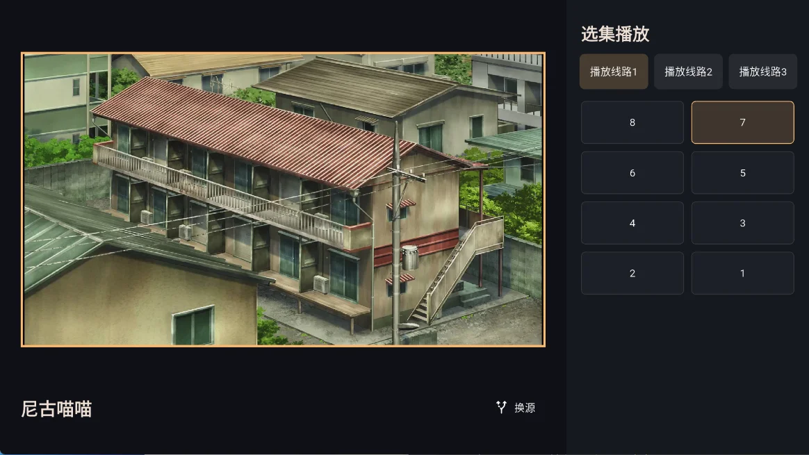

<div align=center>

<h1>ZZZFun</h1>

</img>

</img>
</img>

<p>这是一个基于 Flutter 开发的追番看番平台，专为 Android TV 和 投影仪 等大屏设备设计。项目完全适配遥控器操作，拥有流畅的焦点动画以及完善的播放体验</p>
</div>

## 屏幕截图
<p align="center">
  
  
</p>

<p align="center">
  
  
</p>

<p align="center">
  
  
</p>

## 当前功能

- 首页展示当前季度热门番剧，按 Bangumi 热度排序
- 日期表展示周一至周日的放送内容
- 搜索番剧，支持热度排序、关键词二次匹配、分页和页面缓存
- Bangumi 番剧元数据、评分、简介、标签和海报解析
- 独立番剧详情页，支持从首页、日期表、搜索和本地片单进入
- KazumiRules API Level 8 规则读取、搜索、线路和分集解析
- 规则仓库支持远程刷新、规则安装、更新和删除，已安装规则保存在本地
- 多规则播放源检索、别名重试、候选结果选择和分集切换
- WebView 播放页解析 m3u8/mp4，并使用 `video_player` 播放
- TV 播放器支持全屏、焦点导航、遥控器快进快退、进度控制和上下集切换
- 首页海报轮播，支持键盘、遥控器方向键切换
- 本地收藏和观看历史，使用 `SharedPreferences` 持久化保存
- 网络海报使用内存和磁盘缓存，减少重复加载
- 独立设置页，支持规则管理、外观设置、缓存清理、开发者日志和关于页面
- 日志支持 debug、info、warning、error 等级以及持久化查看
- 适配 Android TV、模拟器、移动设备和桌面窗口布局

## 使用说明

1. 打开“设置”中的“规则管理”，刷新规则仓库并安装需要使用的播放规则。
2. 从首页、日期表、搜索或片单进入番剧详情页。
3. 在详情页打开播放源选择窗口，选择可用播放源和搜索结果。
4. 进入播放页后，可以在全屏播放器中使用遥控器操作进度、播放状态和分集。

播放规则只会使用已经安装到本地的规则。规则对应的第三方网站可能出现域名变更、网络不可达、反爬验证或资源失效等情况，检索和播放结果会因此变化。


## 开发环境

- Flutter stable SDK，需包含与项目兼容的 Dart SDK 3.10.4 或更高版本
- Android Studio 或其他 Flutter 开发工具

## 开发命令

```bash
flutter pub get
flutter analyze
flutter test
flutter run
```

构建 Android Debug APK：

```bash
flutter build apk --debug
```

构建带时间戳版本的 Android Release APK（Windows PowerShell）：

```powershell
.\tool\build_release.ps1
```

脚本会用当前时间生成 `versionName` 和 Unix 时间戳 `versionCode`，并将 APK 输出为
`build/releases/zzzfun-release-YYYYMMDD-HHmmss.apk`。这样电视端安装新包时版本号会高于之前的测试包；如果仍提示签名不一致，则说明旧包使用了不同签名，需要先卸载旧包。

## 项目结构

```text
lib/
├── home_page.dart                 # 应用外壳、导航和页面状态
├── anime_nav_widgets.dart         # 导航栏和焦点交互组件
├── models/                        # 本地、Bangumi 和视频资源模型
├── pages/                         # 首页、搜索、日期表、片单、设置、详情和播放页
├── widgets/                       # 海报、卡片、横幅和通用界面组件
└── services/                      # API、规则、视频资源、存储和日志服务
    ├── bangumi_api_service.dart     # Bangumi 元数据接口
    ├── kazumi_rules_repository.dart # KazumiRules 索引、下载和本地规则管理
    ├── kazumi_api_rule_engine.dart  # API/XPath 规则网络请求和结果解析
    ├── json_path_service.dart       # 规则使用的 JSONPath 子集
    ├── video_resource_service.dart  # 视频资源层统一入口
    ├── video_source_resolver.dart   # 播放页 WebView 和媒体地址提取
    ├── anime_storage_service.dart   # 收藏和历史持久化
    └── app_logger.dart              # 日志服务
test/
├── bangumi_api_service_test.dart       # Bangumi API 解析和请求测试
├── kazumi_api_rule_engine_test.dart    # 规则执行测试
└── kazumi_rules_repository_test.dart   # 规则仓库缓存测试
```

## 数据来源与致谢

- [Bangumi](https://github.com/bangumi/api)：感谢 Bangumi 项目提供开放的番剧元数据、搜索和放送日历数据。
- [Kazumi](https://github.com/Predidit/Kazumi)：感谢 Kazumi 项目在规则化播放源和 TV 端交互设计方面提供的参考。
- [KazumiRules](https://github.com/Predidit/KazumiRules)：感谢 KazumiRules 项目提供公开的播放规则文件。相关许可信息见 [THIRD_PARTY_NOTICES.md](THIRD_PARTY_NOTICES.md)。

## 免责声明

本项目是完全开源的 Flutter 客户端项目，仅用于软件开发和界面研究。本项目没有任何服务端程序，客户端可以独立运行。

所有视频资源、视频播放地址和相关网页内容均来自互联网中的第三方网站。本项目不提供、不存储、不上传任何视频文件，也不提供视频资源服务器或视频播放地址。项目只根据用户安装的公开规则请求第三方网站，并尝试解析其返回的公开页面或媒体地址。

使用第三方数据服务、网站、规则和播放地址时，请遵守当地法律法规以及相关服务的使用条款，并自行承担使用这些第三方服务产生的风险。


## 第三方规则

ZZZFun 使用 [Predidit/KazumiRules](https://github.com/Predidit/KazumiRules) 提供的规则文件。规则文件在运行时从公开仓库读取，ZZZFun 自己实现网络请求和 API Level 8 规则解析，不复制 Kazumi 项目的 GPL-3.0 执行代码。KazumiRules 仓库使用 MIT License，相关版权和许可信息见 [THIRD_PARTY_NOTICES.md](THIRD_PARTY_NOTICES.md)。规则只描述如何请求第三方网站，规则仓库不代表第三方网站内容或播放地址的授权。
